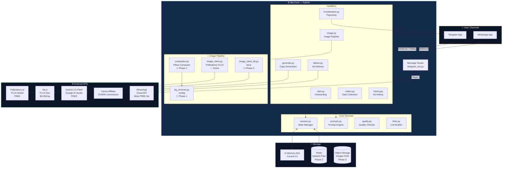
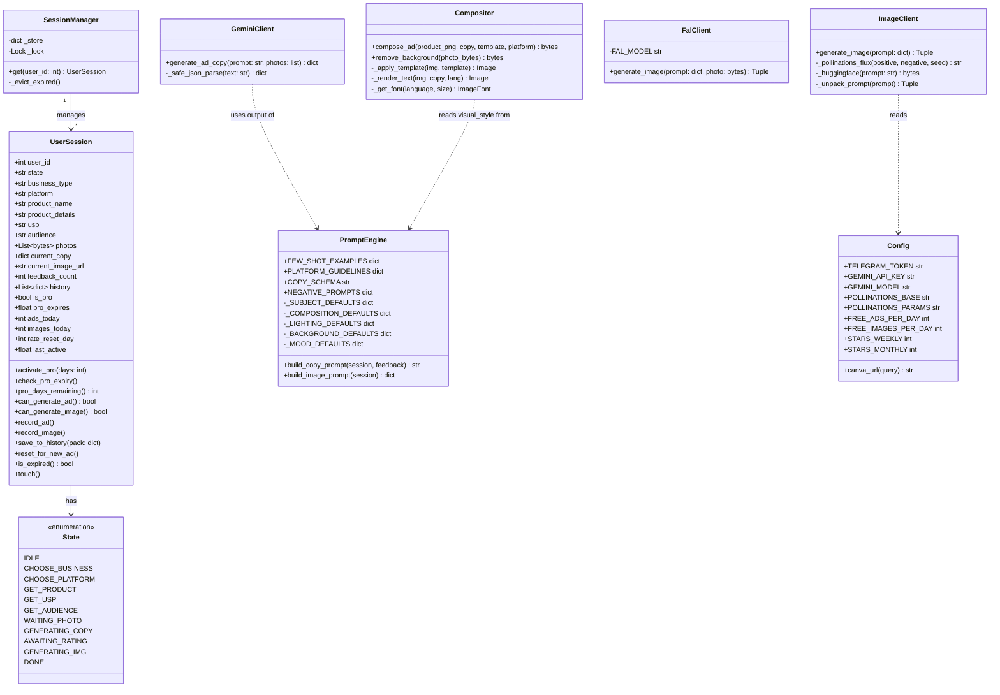
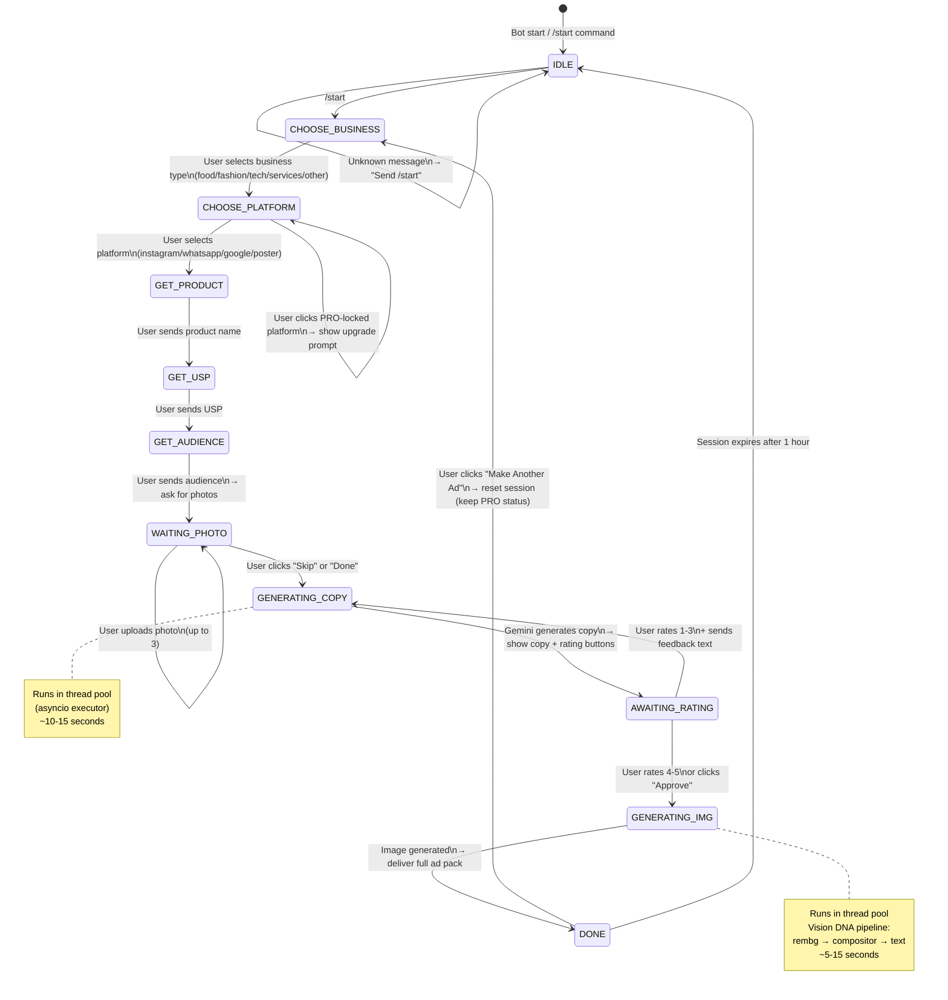
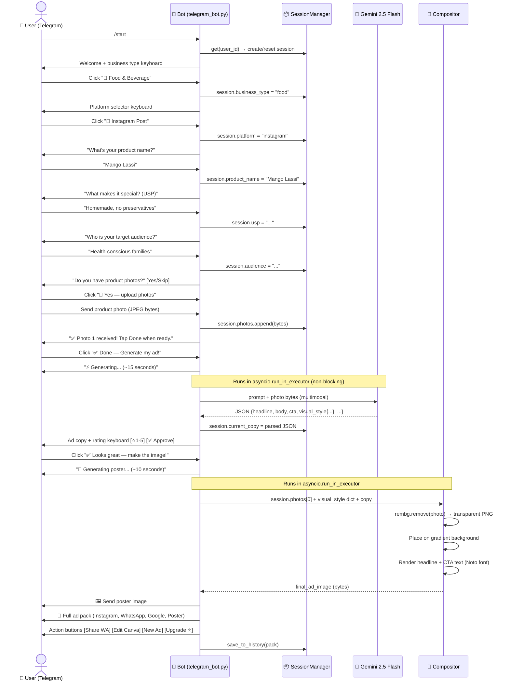
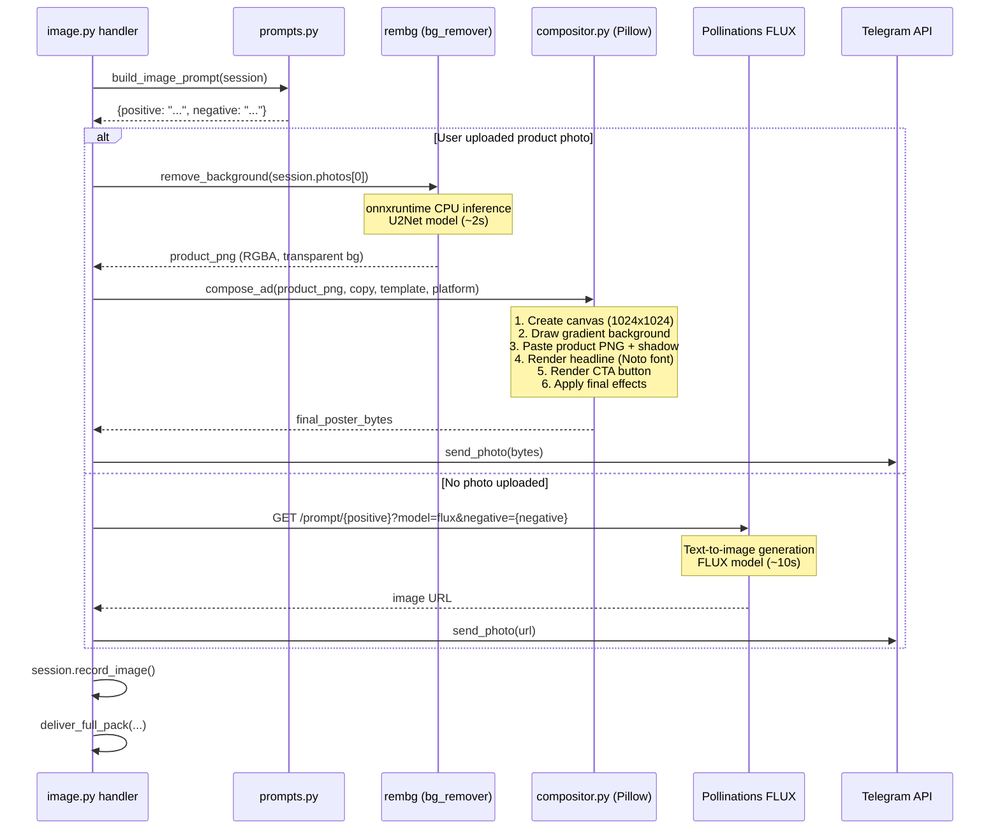
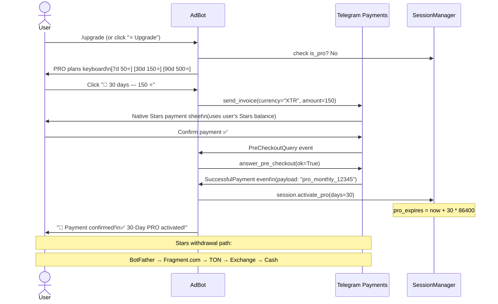
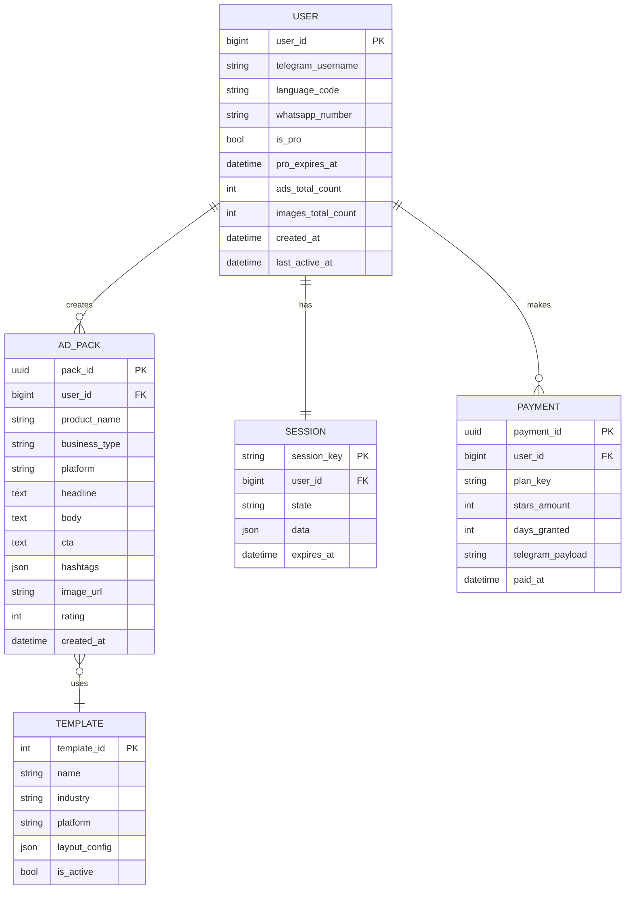

# 📐 AdBot — Technical Requirements, Architecture & Global Launch Plan
> **Document Type**: Engineering Reference + Business Operations  
> **Scope**: Code-level requirements, UML diagrams, deployment, cost model  
> **Last Updated**: April 2026

---

## Table of Contents
1. [System Architecture Overview](#1-system-architecture-overview)
2. [UML Diagrams](#2-uml-diagrams)
   - 2.1 Component Diagram
   - 2.2 Class Diagram (Current Codebase)
   - 2.3 Session State Machine
   - 2.4 User Flow Sequence Diagram
   - 2.5 Image Pipeline Sequence Diagram
   - 2.6 Payment Flow Sequence Diagram
   - 2.7 Deployment Diagram
   - 2.8 Entity Relationship Diagram (Future DB)
3. [Technical Requirements by Phase](#3-technical-requirements-by-phase)
4. [API Contracts & Interfaces](#4-api-contracts--interfaces)
5. [Performance & Scalability Requirements](#5-performance--scalability-requirements)
6. [Security Requirements](#6-security-requirements)
7. [Global Launch Plan](#7-global-launch-plan)
8. [Full Cost Breakdown](#8-full-cost-breakdown)
9. [Infrastructure Decision Matrix](#9-infrastructure-decision-matrix)

---

## 1. System Architecture Overview

### Current Architecture (V1 — Live)
```
Single-process Python bot on local Mac / Railway
No external database — all state in-memory (RAM)
Two external AI APIs: Gemini (copy) + Pollinations (image)
```

### Target Architecture (V2 — Post Investment)
```
Multi-process bot cluster behind load balancer
Redis for persistent session storage
Pillow compositor replaces Pollinations
WhatsApp + Telegram as dual channels
CDN for generated image delivery
```

---

## 2. UML Diagrams

### 2.1 System Component Diagram



---

### 2.2 Class Diagram (Current Codebase)



---

### 2.3 User Session State Machine



---

### 2.4 Full User Flow Sequence Diagram



---

### 2.5 Image Generation Pipeline (Detailed)



---

### 2.6 Telegram Stars Payment Flow



---

### 2.7 Deployment Architecture Diagram

```mermaid
graph TB
    subgraph Internet["🌐 Internet"]
        TG_SERVERS[Telegram Servers\napi.telegram.org]
        META_SERVERS[Meta WhatsApp\nCloud API Servers]
        USERS[Millions of Users\nGlobally]
    end

    subgraph Current_V1["Current — V1 (Local / Railway Free)"]
        PROC1[Single Python Process\ntelegram_bot.py\nPolling mode]
    end

    subgraph Target_V2["Target V2 — Railway / Render Pro"]
        LB[Load Balancer\nnginx]
        BOT1[Bot Worker 1\nWebhook mode]
        BOT2[Bot Worker 2\nWebhook mode]
        BOT3[Bot Worker 3\nWebhook mode]
        REDIS_CACHE[(Redis\nUpstash Free\nSession Storage)]
        IMG_WORKER[Image Worker\nrembg + Pillow\nCPU-intensive]
    end

    subgraph Target_V3["Target V3 — GCP / AWS (Post Series A)"]
        GCP_LB[Cloud Load Balancer]
        BOT_CLUSTER[Bot Cluster\n3-10 instances\nauto-scaling]
        REDIS_CLUSTER[(Redis Cluster\nFully managed)]
        IMG_CLUSTER[Image Workers\nGPU instances\nfor rembg speed]
        CDN[Cloud CDN\nGenerated images\nglobal edge]
        DB[(PostgreSQL\nUser data\nAd history)]
    end

    USERS --> TG_SERVERS
    USERS --> META_SERVERS
    TG_SERVERS -->|polling| PROC1
    TG_SERVERS -->|webhook HTTPS| LB
    META_SERVERS -->|webhook HTTPS| LB
    LB --> BOT1
    LB --> BOT2
    LB --> BOT3
    BOT1 <--> REDIS_CACHE
    BOT2 <--> REDIS_CACHE
    BOT3 <--> REDIS_CACHE
    BOT1 --> IMG_WORKER
    IMG_WORKER --> CDN

    style Current_V1 fill:#1a3a40,stroke:#2ECC71
    style Target_V2 fill:#1a2a40,stroke:#4F8EF7
    style Target_V3 fill:#2a1a40,stroke:#F5A623
```



---

### 2.8 Entity Relationship Diagram (Future Database)



---

## 3. Technical Requirements by Phase

### Phase 0 — Current (V1, Live)
| Requirement | Implementation | Status |
|---|---|---|
| Telegram bot framework | python-telegram-bot 21.5 | ✅ Live |
| AI copy generation | Gemini 2.5 Flash | ✅ Live |
| Multimodal photo input | Gemini Vision API | ✅ Live |
| Image generation | Pollinations.ai FLUX | ✅ Live |
| Session management | In-memory dict + threading.Lock | ✅ Live |
| Rate limiting | Per-user daily counters in session | ✅ Live |
| PRO subscription | Telegram Stars (XTR currency) | ✅ Live |
| Affiliate links | Canva affiliate URL builder | ✅ Live |
| Ad history | In-memory list (last 5) | ✅ Live |
| JSON parsing | 4-stage robust parser | ✅ Live |

### Phase 1 — Core Quality (Q2 2026)
| Requirement | Technology | Installation | Priority |
|---|---|---|---|
| Background removal | `rembg==2.0.57` | `pip install rembg onnxruntime` | 🔴 Critical |
| Image compositing | `Pillow` (already installed) | Already in requirements.txt | 🔴 Critical |
| Multi-language text | `Noto Sans` (Google Fonts) | Download at setup | 🔴 Critical |
| Arabic RTL text | `arabic-reshaper`, `python-bidi` | `pip install arabic-reshaper python-bidi` | 🟡 High |
| Language detection | Telegram `user.language_code` | Built-in | 🔴 Critical |
| Template engine | Custom `compositor.py` | New file | 🔴 Critical |
| Font manager | Custom `font_manager.py` | New file | 🟡 High |
| Session persistence | Redis via `redis-py` + Upstash | `pip install redis` | 🟡 High |

**New files to create (Phase 1):**
```
bot/
├── compositor.py      # Pillow-based ad layout engine
├── bg_remover.py      # rembg wrapper with error handling
├── font_manager.py    # Noto font downloader + multilingual renderer
├── language.py        # Language detection + locale mapping
└── templates/
    ├── split_screen.py
    ├── hero_center.py
    ├── minimalist.py
    └── bold_poster.py
```

### Phase 2 — WhatsApp + Scale (Q4 2026)
| Requirement | Technology | Setup Effort | Cost |
|---|---|---|---|
| WhatsApp bot | `aiohttp` + Meta Cloud API | 2-3 days | $0 (free tier) |
| Webhook server | `fastapi` or `flask` | 1 day | $0 |
| Redis sessions | `redis-py` + Upstash | 4 hours | $0 free tier |
| Image CDN | Cloudflare R2 | 2 hours | $0 (10GB free) |
| Rate limit Redis | Redis sorted sets | 4 hours | $0 |
| Admin dashboard | Simple FastAPI HTML page | 3 days | $0 |

### Phase 3 — Enterprise (Q1-Q2 2027)
| Requirement | Technology | Cost |
|---|---|---|
| Studio-grade images | fal.ai FLUX image-to-image | $0.025-0.05/image |
| Video ads | fal.ai video generation | ~$0.10-0.50/video |
| Brand kit storage | PostgreSQL + Cloudflare R2 | $15-30/month |
| Analytics | Custom + Grafana | $0 (self-hosted) |
| Multi-tenant | FastAPI + per-org Redis namespacing | Engineering effort |
| GPU acceleration | RunPod / Lambda Labs | $0.20-0.50/hr |

---

## 4. API Contracts & Interfaces

### 4.1 Gemini API — Input/Output Contract

```python
# INPUT
prompt = build_copy_prompt(session)      # str — see prompts.py
photos = session.photos                  # List[bytes] — JPEG, max 3, max 5MB each

# OUTPUT (guaranteed JSON structure)
{
    "headline": str,                     # 6-10 words
    "body": str,                         # 2-4 sentences
    "cta": str,                          # Action verb + outcome
    "hashtags": List[str],               # 3-5 tags without #
    "audience_description": str,         # 1 sentence
    "ab_variation": str,                 # Alternative headline
    
    "visual_style": {
        "subject": str,                  # Product DNA (colors, materials, shape)
        "composition": str,              # Camera framing
        "lighting": str,                 # Lighting setup
        "background": str,               # Background description
        "mood": str,                     # Emotional tone
        "negative": str,                 # Comma-separated things to avoid
    },
    
    "instagram": {"headline": str, "body": str, "cta": str, "hashtags": List[str]},
    "whatsapp":  {"body": str},
    "google":    {"h1": str, "h2": str, "h3": str, "d1": str, "d2": str},
    "poster":    {"headline": str, "tagline": str, "bullets": List[str], "cta": str}
}

# LIMITS
max_output_tokens = 4096                 # Set in GenerationConfig
temperature = 0.85                       # Creative but consistent
response_mime_type = "application/json"  # Hint to model
```

### 4.2 Compositor API Contract (Phase 1)

```python
# bot/compositor.py — Public interface

def compose_ad(
    product_png: bytes,          # RGBA PNG with transparent background
    copy: dict,                  # Gemini JSON output  
    template: str,               # "split_screen" | "hero_center" | "minimalist" | "bold_poster"
    platform: str,               # "instagram" | "poster" | "whatsapp"
    language: str = "en",        # ISO 639-1 language code
    brand_color: tuple = None,   # Optional (R, G, B) extracted from logo
) -> bytes:                      # Returns JPEG bytes of final ad

def remove_background(
    photo_bytes: bytes,          # Raw JPEG/PNG bytes from Telegram
    model: str = "u2net",        # rembg model: u2net | u2net_human_seg | isnet-general-use
) -> bytes:                      # Returns PNG bytes (RGBA, transparent background)

def extract_brand_color(
    photo_bytes: bytes,          # Logo or product photo
) -> tuple:                      # Returns dominant (R, G, B) color
```

### 4.3 WhatsApp Cloud API Contract (Phase 2)

```python
# Incoming webhook (POST /webhook)
{
    "object": "whatsapp_business_account",
    "entry": [{
        "changes": [{
            "value": {
                "messages": [{
                    "from": "919876543210",  # User's WhatsApp number
                    "type": "text" | "image",
                    "text": {"body": "..."},
                    "image": {"id": "...", "mime_type": "image/jpeg"}
                }]
            }
        }]
    }]
}

# Outgoing — send text message
POST https://graph.facebook.com/v19.0/{phone_number_id}/messages
{
    "messaging_product": "whatsapp",
    "to": "919876543210",
    "type": "text",
    "text": {"body": "Your message here"}
}

# Outgoing — send image
{
    "type": "image",
    "image": {"link": "https://cdn.adbot.app/ads/abc123.jpg"}
}
```

---

## 5. Performance & Scalability Requirements

### Response Time SLAs
| Operation | Target P50 | Target P95 | Max Acceptable |
|---|---|---|---|
| Bot response to any message | < 300ms | < 800ms | 2000ms |
| Gemini copy generation | < 8s | < 15s | 30s |
| Background removal (rembg) | < 3s | < 6s | 10s |
| Pillow compositing | < 1s | < 2s | 5s |
| Pollinations FLUX image | < 12s | < 25s | 45s |
| Full flow (photo → ad) | < 25s | < 45s | 90s |

### Concurrency Requirements
```
V1 (0-1K users):     1 process, asyncio + thread pool (executor)
V2 (1K-50K users):   3 worker processes, webhook mode, shared Redis
V3 (50K-500K users): Auto-scaling cluster, 5-20 instances
V4 (500K+ users):    Multi-region, geo-routing, 50+ instances
```

### Thread Pool Configuration (Current)
```python
# generate.py / image.py
loop = asyncio.get_running_loop()
# Default executor: ThreadPoolExecutor(max_workers=min(32, os.cpu_count() + 4))
# For a 4-core server: max 8 concurrent AI calls
# For a 8-core server: max 12 concurrent AI calls
```

### Rate Limits (Business Logic)
```
Free tier:  3 ads/day,  2 images/day per user
PRO tier:   999 ads/day, 10 images/day per user
System:     No global rate limit (bounded by Gemini free quota)
Gemini free quota: 1,500 requests/day, 15 requests/minute
```

---

## 6. Security Requirements

### API Key Management
```bash
# ALL keys in .env — NEVER in source code
TELEGRAM_BOT_TOKEN=    # From BotFather — rotate if exposed
GEMINI_API_KEY=        # From Google AI Studio — has quota, rotate if needed
FAL_API_KEY=           # From fal.ai — has billing, rotate if exposed
META_WA_TOKEN=         # From Meta — rotate immediately if exposed
META_WA_VERIFY_TOKEN=  # Your custom webhook verification string

# .env must NEVER be committed to git
# .gitignore must include: .env
```

### Webhook Security (Phase 2)
```python
# Validate all incoming Telegram webhooks
# python-telegram-bot handles this automatically via secret_token

# Validate WhatsApp webhooks
import hmac, hashlib
def validate_whatsapp_webhook(payload: bytes, signature: str, app_secret: str) -> bool:
    expected = hmac.new(app_secret.encode(), payload, hashlib.sha256).hexdigest()
    return hmac.compare_digest(f"sha256={expected}", signature)
```

### Data Privacy Requirements
```
Photos: Stored in session RAM only, never written to disk, evicted after 1hr
Copy:   Stored in session + history (last 5), in-memory only
PII:    user_id (Telegram integer only, no name/username stored)
GDPR:   Right to erasure → /deletedata command (clears session)
Legal:  Terms of service + privacy policy required before launch in EU
```

### Input Validation
```python
# All user text inputs must be sanitised before Gemini
MAX_PRODUCT_NAME  = 100   # chars
MAX_USP           = 500   # chars
MAX_AUDIENCE      = 300   # chars
MAX_FEEDBACK      = 500   # chars
MAX_PHOTOS        = 3     # files
MAX_PHOTO_SIZE    = 5_000_000  # 5MB per photo
```

---

## 7. Global Launch Plan

### 7.1 Region Prioritisation Matrix

| Region | Priority | WhatsApp Penetration | Language | Market Size | Launch Quarter |
|---|---|---|---|---|---|
| **India** | 🔴 P0 | 97% of smartphone users | Hindi, English | 80M SMBs | Q2 2026 |
| **Nigeria** | 🔴 P0 | 93% of smartphone users | English, Hausa | 42M SMBs | Q3 2026 |
| **Brazil** | 🔴 P0 | 99% of smartphone users | Portuguese | 20M SMBs | Q3 2026 |
| **Indonesia** | 🟡 P1 | 87% users | Bahasa Indonesia | 65M SMBs | Q4 2026 |
| **Saudi Arabia** | 🟡 P1 | 71% users | Arabic | 12M SMBs | Q4 2026 |
| **Mexico** | 🟡 P1 | 91% users | Spanish | 14M SMBs | Q4 2026 |
| **Germany** | 🟢 P2 | 62% users | German | 3.5M SMBs | Q1 2027 |
| **UK** | 🟢 P2 | 78% users | English | 6M SMBs | Q1 2027 |

### 7.2 Legal & Compliance Requirements by Region

| Region | Regulation | Requirement | Timeline |
|---|---|---|---|
| EU (Germany, France) | GDPR | Privacy policy, data processing agreement, erasure rights | Before EU launch |
| India | IT Act 2000 | Data localisation option, grievance officer contact | Before India scale |
| USA | CAN-SPAM | Opt-out for any email touches | If email added |
| All | WhatsApp Business Policy | No spam, opt-in messages only, business verification | Before WA launch |
| Brazil | LGPD | Similar to GDPR — data protection officer | Before Brazil launch |

### 7.3 Infrastructure Per Region

```
Phase 1 (India launch):
  Single Railway server in US-East or EU (Telegram works globally)
  Redis: Upstash global (auto-routes to nearest region)
  CDN: Cloudflare R2 (free, global edge)
  
Phase 2 (Multi-region):
  Deploy bot workers in: US-East, EU-West, Asia-Pacific (Singapore)
  Redis: Upstash multi-region read replicas
  CDN: Cloudflare global
  
Phase 3 (Global scale):
  Google Cloud Run (auto-scales, pay-per-request)
  Cloud SQL PostgreSQL (multi-region)
  Google Cloud CDN
  Google Translate API for additional language support
```

### 7.4 Operational Launch Checklist

```
Pre-launch (2 weeks before):
[ ] Set BotFather profile: photo, description, commands list
[ ] Privacy policy + Terms of service live at URL
[ ] Set webhook (replace polling for production)
[ ] Load test: 100 concurrent users
[ ] Set up error alerting (Telegram notification to admin channel)
[ ] Set up uptime monitoring (UptimeRobot free)
[ ] Backup plan if Gemini quota runs out (fallback prompts)
[ ] Test all payment flows (Telegram Stars invoices)
[ ] Test all languages (Hindi, Arabic, Portuguese)

Launch day:
[ ] Deploy to production server
[ ] Monitor error logs in real-time
[ ] Post in 5 target WhatsApp/Telegram groups
[ ] Record a demo video for social media
[ ] Monitor Gemini quota usage

Post-launch (Week 1):
[ ] Daily review of error logs
[ ] Monitor user drop-off points in flow
[ ] Collect feedback via /feedback command
[ ] Tune prompts based on real output quality
[ ] Prepare first iteration based on user feedback
```

---

## 8. Full Cost Breakdown

### 8.1 Development Cost (Time)

| Phase | Feature | Engineer Days | At $200/day | At $500/day |
|---|---|---|---|---|
| **Phase 1** | Background removal (rembg) | 3 | $600 | $1,500 |
| | Pillow compositor (3 templates) | 7 | $1,400 | $3,500 |
| | Font manager + multilingual | 4 | $800 | $2,000 |
| | Language detection + Hindi | 2 | $400 | $1,000 |
| | Arabic RTL support | 3 | $600 | $1,500 |
| | Redis session persistence | 2 | $400 | $1,000 |
| | Testing + QA | 4 | $800 | $2,000 |
| **Phase 1 Total** | | **25 days** | **$5,000** | **$12,500** |
| **Phase 2** | WhatsApp Cloud API | 5 | $1,000 | $2,500 |
| | Admin dashboard | 5 | $1,000 | $2,500 |
| | Load testing + scale | 3 | $600 | $1,500 |
| | 3 more language packs | 6 | $1,200 | $3,000 |
| **Phase 2 Total** | | **19 days** | **$3,800** | **$9,500** |
| **Phase 3** | fal.ai integration | 2 | $400 | $1,000 |
| | Video ad generation | 8 | $1,600 | $4,000 |
| | Brand kit + DB | 10 | $2,000 | $5,000 |
| | Agency white-label | 15 | $3,000 | $7,500 |
| **Phase 3 Total** | | **35 days** | **$7,000** | **$17,500** |
| **GRAND TOTAL** | | **79 days** | **$15,800** | **$39,500** |

### 8.2 Infrastructure Costs at Scale

| User Scale | Server | Redis | CDN/Storage | Database | **Monthly Total** |
|---|---|---|---|---|---|
| 0 – 1,000 | $0 (Railway free) | $0 (Upstash free) | $0 (CF R2 free) | None | **$0** |
| 1,000 – 10,000 | $5 (Railway Hobby) | $0 (Upstash free) | $0 | None | **$5** |
| 10,000 – 50,000 | $20 (Railway Pro) | $10 (Upstash) | $5 | None | **$35** |
| 50,000 – 200,000 | $80 (3x Railway Pro) | $30 (Upstash Pro) | $20 | $15 (Supabase) | **$145** |
| 200,000 – 1M | $350 (GCP Cloud Run) | $80 (Redis Cloud) | $50 | $60 (Cloud SQL) | **$540** |
| 1M+ | $2,000 (GCP enterprise) | $400 (Redis Enterprise) | $200 | $300 | **$2,900** |

### 8.3 API Costs at Scale

| API | Free Tier | Cost After Free | At 10K users/day | At 100K users/day |
|---|---|---|---|---|
| **Gemini 2.5 Flash** | 1,500 req/day, 15 RPM | $0.075/1M input tokens | $0-15/month | $50-150/month |
| **Pollinations FLUX** | Unlimited | Always free | $0 | $0 |
| **WhatsApp Cloud API** | 1,000 conv/month | $0.004-0.09/conv | $40-360/month | $400-3,600/month |
| **fal.ai FLUX** | $25 credit | $0.025-0.05/image | $250-500/month | $2,500-5,000/month |
| **rembg** | Infinite (local) | $0 (CPU compute) | $0 (CPU cost) | $50/month GPU |
| **Upstash Redis** | 10K req/day free | $0.20/100K req | $0-20/month | $50-200/month |

### 8.4 Revenue vs Cost (Break-Even Analysis)

```
Break-even scenario:
  PRO price:   $2/month average (low end of Stars conversion)
  Server cost: $35/month at 10,000 users
  Break-even:  35/2 = 18 PRO users out of 10,000 (0.18% conversion)
  
  Industry average PRO conversion: 2-5%
  At 10,000 users → 200-500 PRO users → $400-1,000/month
  
  PROFITABILITY at 10,000 users:
  Revenue: $400-1,000 (PRO) + $200 (Canva affiliate) = $600-1,200/month
  Costs:   $35 (infrastructure) + $15 (APIs) = $50/month
  PROFIT:  $550-1,150/month ✅
```

### 8.5 Complete 3-Year P&L Model

| | Year 1 | Year 2 | Year 3 |
|---|---|---|---|
| **Total Users** | 25,000 | 200,000 | 1,000,000 |
| **PRO Users** | 1,250 (5%) | 16,000 (8%) | 100,000 (10%) |
| **PRO Revenue** | $37,500 | $480,000 | $3,000,000 |
| **Affiliate Revenue** | $6,000 | $48,000 | $240,000 |
| **Enterprise Revenue** | $0 | $24,000 | $360,000 |
| **Total Revenue** | **$43,500** | **$552,000** | **$3,600,000** |
| | | | |
| **Infrastructure** | $600 | $4,200 | $34,800 |
| **API Costs** | $1,800 | $18,000 | $120,000 |
| **Engineering** | $60,000 | $120,000 | $240,000 |
| **Marketing** | $20,000 | $60,000 | $200,000 |
| **Legal/Ops** | $5,000 | $15,000 | $40,000 |
| **Total Costs** | **$87,400** | **$217,200** | **$634,800** |
| | | | |
| **Net Profit/(Loss)** | **($(43,900))** | **$334,800** | **$2,965,200** |
| **Profit Margin** | -101% | 61% | 82% |

> Year 1 loss covered by $150K seed investment. Profitable from Month 8 onward.

---

## 9. Infrastructure Decision Matrix

### Hosting Platform

| Platform | Free Tier | Paid | Pros | Cons | Verdict |
|---|---|---|---|---|---|
| **Railway** | 500hr/month | $5/mo Hobby | Easy deploy, GitHub integration, fast | Sleeps on free | ✅ **Use now + Phase 1** |
| **Render** | 750hr/month | $7/mo | Reliable, Docker support | Slower deploys | 🟡 Alternative |
| **Fly.io** | 2 small VMs free | $1.94/mo | Global regions, fast | Learning curve | 🟡 Phase 2 option |
| **Google Cloud Run** | 2M req/month | Pay-per-use | Auto-scale, global, zero-idle-cost | Complex setup | ✅ **Use at Phase 3** |
| **AWS Lambda** | 1M req/month | Pay-per-use | Mature, reliable | Cold starts, complex | 🟡 Phase 3 option |
| **VPS (Hetzner)** | None | €4/mo | Full control, powerful for price | Manual ops | 🟡 Phase 2 budget option |

### Session Storage

| Platform | Free | Paid | Verdict |
|---|---|---|---|
| **In-memory (current)** | $0 | N/A | ✅ Phase 0-1 (restart = data loss) |
| **Upstash Redis** | 10K req/day | $0.20/100K | ✅ **Phase 1-2** |
| **Redis Cloud** | 30MB free | $15/month | 🟡 Phase 2-3 |
| **Supabase** | 500MB free | $25/month | 🟡 Phase 3 (with Postgres) |

### Image CDN

| Platform | Free | Paid | Verdict |
|---|---|---|---|
| **Cloudflare R2** | 10GB + 1M ops | $0.015/GB | ✅ **Best option — use from Phase 2** |
| **Backblaze B2** | 10GB | $0.006/GB | 🟡 Cheapest raw storage |
| **AWS S3 + CloudFront** | 12 months free | $0.023/GB | 🟡 Phase 3 |
| **Google Cloud Storage** | 5GB | $0.020/GB | 🟡 Phase 3 with GCP |

---

*Document path: `docs/TECHNICAL_REQUIREMENTS.md`*  
*This is a living document — update as each phase is completed.*
